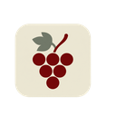
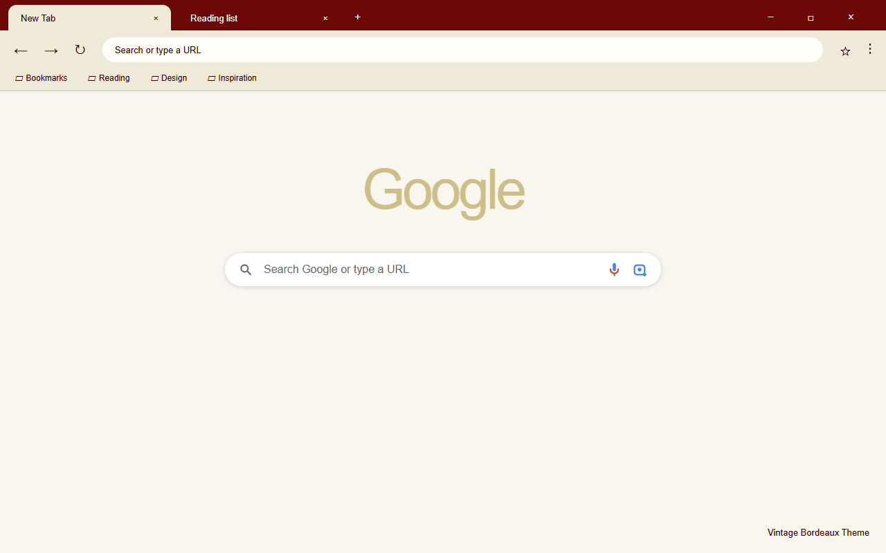
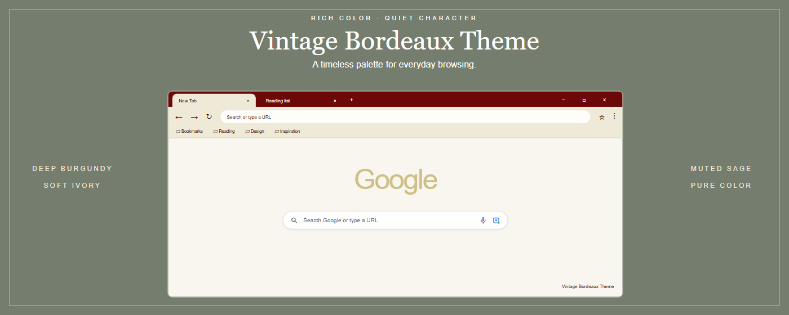

<p align="center">
  
</p>

<h1 align="center">Vintage Bordeaux Theme</h1>

<p align="center">
  A refined Chrome theme in deep burgundy, soft ivory, and muted sage.
</p>

<p align="center">
  
</p>

## Overview

Vintage Bordeaux Theme dresses your browser in a vintage wine-label palette. A deep burgundy frame carries a soft ivory active tab and toolbar, while muted sage accents the inactive window. Dark cherry text and icons stay sharp against the light surfaces, and the new tab page opens on a pale ivory field with a warm white address bar.

The theme only recolors the parts of Chrome that themes are allowed to touch. It does not recolor websites, does not replace the new tab page, and ships with no scripts, no tracking, and no permission requests.

## Palette

| Role | Hex | Used for |
|------|-----|----------|
| Bordeaux | `#6D0808` | top frame, button background |
| Black cherry | `#2D0000` | text and icons on light surfaces, tab title, links, NTP header |
| Muted sage | `#757D6F` | inactive window frame, brand accents |
| Ivory | `#EEEAD7` | active tab, toolbar, bookmarks bar |
| Light ivory | `#F8F6EE` | new tab page background |
| Warm white | `#FFFDFA` | address bar, tab text on the burgundy frame |

The first four tones come from the reference swatch card. The two lighter tones soften large surfaces so the burgundy never feels heavy. Text stays dark on purpose — sage is too low-contrast to read at small sizes on ivory.

## Design

- Solid colors only — no wallpaper, no texture, no gradients.
- Deep burgundy top frame with the ivory active tab flowing into the toolbar.
- Muted sage marks the inactive window, so focus state is obvious at a glance.
- Window buttons share the frame color instead of forming a separate block; Chrome and Windows draw their glyphs, borders, and hover states.
- `ntp_logo_alternate` is enabled, so Chrome adapts the new tab page logo to the theme on its own; the exact tone is generated by Chrome.
- Built for long reading sessions: low-glare surfaces, high text contrast, no saturated fills.

## What you get

- A deep burgundy frame that gives the window a defined, classic edge.
- An ivory toolbar and bookmarks bar that stay quiet and uncluttered.
- A warm white address bar that reads as the brightest point in the UI.
- A pale ivory new tab page with dark cherry links and header text.
- A single 128×128 grape-and-leaf emblem shared by the theme and the store listing.

## Preview

<p align="center">
  
</p>

## Install (unpacked)

1. Open `chrome://extensions`
2. Enable **Developer mode** (top-right)
3. Click **Load unpacked** and select this folder
4. The theme applies immediately; reset it anytime under Settings, then Appearance, then Themes

## Files

- `manifest.json` — theme definition (manifest v3)
- `logo/logo128.png` — 128×128 icon used by both the theme and the store listing
- `store-assets/screenshots/en/` — two 1280×800 English store screenshots (browser, introduction)
- `store-assets/promo/` — store promo tiles (440×280, 1400×560)
- `store-assets/references/` — headless Chromium source HTML and rendered PNGs
- `store-assets/store-description.txt` — store listing copy
- `scripts/` — asset generation and packaging scripts
- `PACKAGING.md` — ZIP packaging conventions

Screenshots and promo tiles are rendered by headless Chromium from plain HTML and CSS using the exact manifest colors. They are illustrative layouts, not native Chrome captures — load the theme to confirm the real result.

## Regenerate and package

Requires Python, Pillow, Playwright, and Chromium.

```powershell
python -m pip install -r scripts/requirements.txt
python -m playwright install chromium
python scripts/generate-store-assets.py
powershell -ExecutionPolicy Bypass -File scripts/package.ps1
```

The packaging script writes a single ZIP whose root contains `manifest.json`, output to `D:\迅雷下载\vibe coding` by default. Promo tiles and screenshots ship inside the ZIP but still need to be uploaded separately in the Chrome Web Store listing form.

## License

Non-commercial use only. See [LICENSE](LICENSE).
